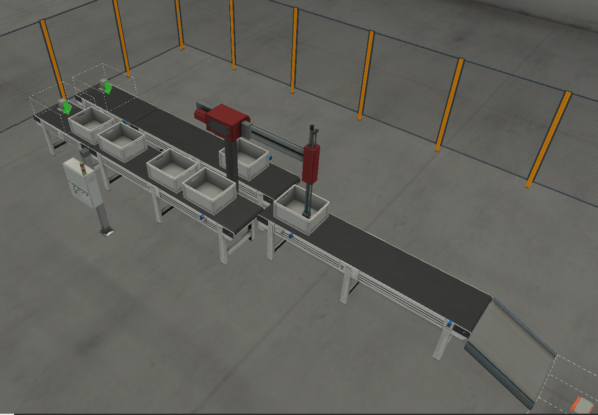

# From-Reinforcement-Learning-to-Reality-Generating-Structured-Text-Logic-Controller-
This repository contains a PLC implementation of the proposed methodology:
  - TIA Portal Projet
  - Control table learned by Reinforcement Learning
  - Operating part simulation Factory IO scene 

|     Task    |     Component             |     Description                     |     Non-parallel compatible tasks    |
|-------------|---------------------------|-------------------------------------|--------------------------------------|
|     T1      |     Feeding Conveyor 1    |     Feed part to position 1         |     T12                              |
|     T2      |     Feeding Conveyor 2    |     Feed part to position 3         |     T13                              |
|     T3      |     Robot                 |     Rotation without part 0 to 1    |     T6                               |
|     T4      |     Robot                 |     Rotation with part 1 to 2       |     T12                              |
|     T5      |     Robot                 |     Deposit part                    |     T8, T9, T10, T11                 |
|     T6      |     Robot                 |     Rotation without part 0 to 3    |     T3                               |
|     T7      |     Robot                 |     Rotation with part 3 to 2       |     T8, T13                          |
|     T8      |     Robot                 |     Rotation without part 2 to 0    |     T5, T7, T10, T11                 |
|     T9      |     Output Conveyor       |     Evacuate part                   |     T5                               |
|     T10     |     Robot                 |     Rotation without part 2 to 1    |     T5, T8, T11                      |
|     T11     |     Robot                 |     Rotation without part 2 to 3    |     T5, T8, T10                      |
|     T12     |     Robot                 |     Take a part in position 1       |     T1, T4, T8                       |
|     T13     |     Robot                 |     Take a part in position 3       |     T2, T7, T8                       |

